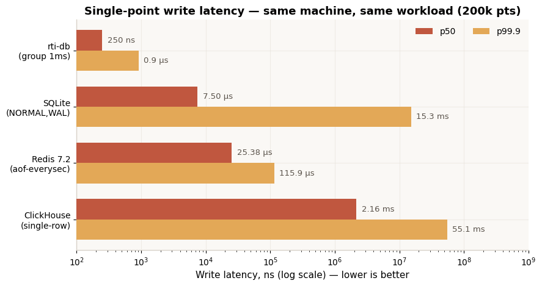
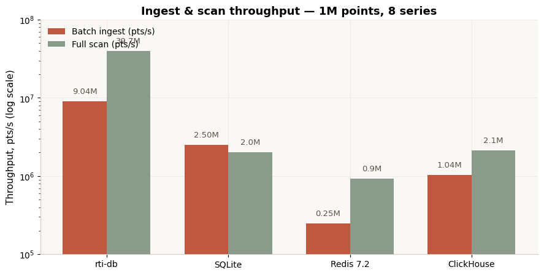
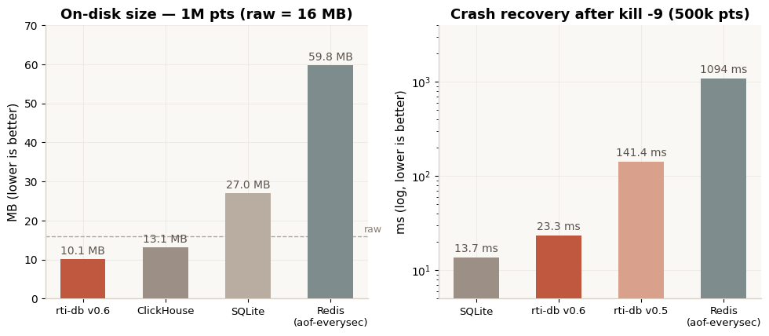
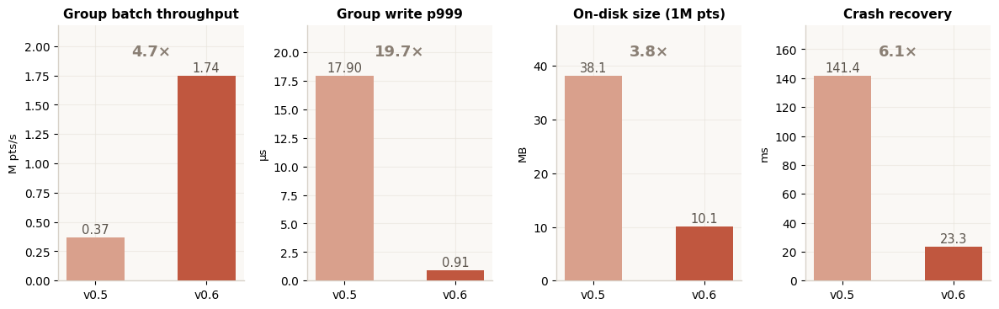

# rti-db

**A hard-real-time embedded time-series data engine in Rust** — the data plane for real-time intelligence.

[中文版 README](README.zh-CN.md)

[](https://github.com/coidea-sys/rti-db/actions/workflows/ci.yml)
[](https://crates.io/crates/rti-db)
[](https://docs.rs/rti-db)
[](#testing--reproducibility)
[](LICENSE-MIT)

```text
sensors / event streams (100 kHz-class)
        │
        ▼  lock-free SPSC enqueue (~0.5 µs, zero-alloc hot path)
┌──────────────┐   batch    ┌───────────┐   seal    ┌────────────────┐
│  Ingest      │ ─────────► │    WAL    │ ────────► │  Segments      │
│  SPSC/MPMC   │            │ group-    │           │  columnar +    │
│  ring buffer │            │ commit CRC│           │  compression   │
└──────────────┘            └───────────┘           └────────────────┘
        │                                                │
        ▼                                                ▼
  MemTable (pooled memory)  ◄─── query: predicate pushdown / zone maps / zero-copy
        │                                                │
        ▼                                                ▼
  fast-lane feature reads (µs)                cold tier (S3) / Raft replicas
```

## Why rti-db? (Positioning)

General-purpose databases trade determinism for generality: GC pauses, allocator jitter, background compactions and unpredictable tail latencies are the price of being good at everything. Real-time intelligence — industrial control, autonomous driving, aerospace GNC, robotics — cannot pay that price on its data plane.

**rti-db makes the opposite trade: it gives up generality to buy determinism.** It is not a SQL database, not a KV store, not an analytics warehouse. It is the missing layer between sensors and decision loops: a storage engine whose write path is O(1), allocation-free, lock-free, and whose worst-case latency can actually be reasoned about.

The design follows TRIZ separation principles: instead of compromising between "fast" and "smart", separate them — a deterministic fast lane (lock-free ingest, verified control loops) and an intelligent slow lane (columnar segments, cold tier, replication), with an explicit durability contract between them.

## What makes it different (Differentiators)

- **Bounded tail latency, structurally.** No GC, zero heap allocation on the steady-state hot path (verified by a global allocation counter test), no lock contention, no background merges in the write path. p999 is bounded by construction, not by tuning.
- **Durability as an explicit API choice.** `put()` = lowest latency, best-effort persistence; `put_durable()` = survives `kill -9` (waits for MemTable apply + WAL append + OS flush, returns a durable watermark). Like Kafka's `acks=0/1/all`, but explicit per call.
- **Crash recovery in ~23 ms.** WAL checkpointing keeps the invariant "the WAL protects exactly the current MemTable" — recovery replays one tail, not the whole log.
- **Real compression: 1.58×** end-to-end on disk (delta-of-delta timestamps + XOR floats + WAL truncation), beating ClickHouse's 1.22× on the same workload.
- **Memory safety with an auditable unsafe surface.** `#![forbid(unsafe_code)]` everywhere except four small crates (`rti-mem`, `rti-buffer`, `rti-wal-uring`, and the documented `rti-vla` C ABI boundary), every `unsafe` block annotated with `// SAFETY:`. ~70% of severe CVEs in C/C++ systems are memory bugs — Rust eliminates that class at compile time.
- **no_std subset.** `rti-core`, `rti-mem`, `rti-buffer` compile for `no_std` (core + alloc) — the same engine runs from an MCU safety island to a cloud server.
- **io_uring pipelined WAL** (Linux, feature-gated, graceful fallback), **multi-shard Raft replication** (independent per-group election, replication, snapshot, membership — all deterministically tested with a virtual clock), **S3 cold tier** (pure-std HTTP client, zero external dependencies), **TSN time alignment** for deterministic networks.
- **Deterministic everything.** Raft tests run on a virtual clock with an in-memory transport — leader election, failover, log consistency and partition scenarios are 100% reproducible (30/30 runs green).

## rti-db & AI (Strategic position)

**AI models are the demand, not the competition.** Foundation models for the physical
world (VLA policies, world models, dual-system stacks like Helix S1/S2, GR00T, pi0)
reason at 10-100 ms; the physical world streams at 1-100 kHz. That three-order-of-magnitude
gap is where embodied AI lives or dies - and it is a **data-plane problem, not a model
problem**. rti-db occupies that gap. The full strategic analysis:
[docs/ai-strategy.md](docs/ai-strategy.md).

Three roles, one position:

| | What AI needs | What rti-db provides |
|---|---|---|
| **Inference time** | S1 fast loops need us-level deterministic access to the latest sensor state; S2 slow reasoning needs episodic context windows | The *working memory of embodied AI* - a KV-cache-for-the-physical-world: O(1) `latest()` reads with zero allocation on the reflex path, columnar history for attention over the recent past |
| **Training time** | Embodied AI is data-starved; every deployed robot must be a data flywheel | The *flight recorder*: lossless episode logging (zero-loss `put_durable`), compressed cold tier to S3, replay-identical reproduction of any decision window |
| **Governance** | Safety certification (aerospace, industrial, transport) demands audit | Deterministic replay: what the model saw, when, and what it decided - reproducible to the microsecond |

**Strategic posture: be Switzerland.** rti-db does not train models, does not serve LLMs,
is not a vector database, and does not compete with NVIDIA Isaac/GR00T, Physical
Intelligence, Figure, or ROS 2 - it *complements* all of them. In the standards war over
embodied-AI stacks, the data plane is the layer everyone needs and no model vendor wants
to build. Open source (MIT OR Apache-2.0) is the commitment device: integrate rti-db
into your stack without fearing that we enter your layer. Whoever owns the data plane
owns the feedback loop - we intend to own it openly.

## Benchmarks (v0.6, measured — not cited)









Full methodology, raw JSON and a one-command reproduction harness (`run_all.sh`, ~35 min) are in `bench/`. Same machine, same workload (1M points, 8 series), same durability tiers, HDR histograms, median of 3 runs. Competitors run with default tuning.

| Metric | rti-db | SQLite (WAL) | Redis 7.2 | ClickHouse 24.8 |
|---|---|---|---|---|
| Single-point write p50 | **0.47 µs** (group) | 7.5 µs | 25.4 µs | 1,940 µs |
| Single-point write p999 | **0.91 µs** (group) | 15.3 **ms** | 116 µs | 27.6 ms |
| Batch ingest | **9.04M pts/s** | 2.50M | 0.25M | 1.04M |
| Full scan | **33M pts/s** | 2.0M | ~1.0M | 2.1M |
| On-disk (1M pts) | **10.1 MB (1.58×)** | 27.0 MB | 59.8 MB (AOF) | 13.1 MB (1.22×) |
| Crash recovery | **23.3 ms** | 13.7 ms | 1,094 ms | n/a (immutable parts) |
| Zero-loss write path | `put_durable` | yes | yes (aof-always) | yes |

**Where rti-db loses — honestly.** Server-side general-purpose aggregation and SQL (ClickHouse's home turf), multi-model queries (Postgres/TimescaleDB), and the async `put()` semantics carry an inherent loss window on crash (bounded by ring capacity — documented, and closed by `put_durable`). No system crushes every database on every metric; rti-db wins structurally on the metrics it was built for.

## Architecture & Strategy (Design philosophy)

14 crates, layered by the same separation principles:

| Crate | Role |
|---|---|
| `rti-core` | Types, errors, TSN time alignment (`no_std`) |
| `rti-mem` | Deterministic memory pools — the master switch for tail latency (`no_std`) |
| `rti-buffer` | Lock-free SPSC/MPMC rings, cache-line separated (`no_std`) |
| `rti-wal` / `rti-wal-uring` | WAL with group commit + checkpointing; io_uring pipelined backend |
| `rti-store` | Columnar segments, delta-of-delta + XOR compression, zone maps, cold tier (S3/local) |
| `rti-query` | Predicate pushdown, vectorized decode, zero-copy iterators |
| `rti-raft` | Raft consensus: single-group core + multi-shard groups (election, replication, snapshot, membership, PreVote) |
| `rti-net` | Minimal TCP line protocol |
| `rti-db` | Facade: `Db::open / put / put_durable / scan / latest / compact` — O(1) latest index + segment compaction |
| `rti-edge` | RTI-Edge integration: four presets (safety island / cognition / planning / AI working memory) |
| `rti-vla` | VLA working-memory adapter: O(1) `latest` / `window` / `ChunkBuffer` + frozen C ABI |
| `rti-export` | LeRobot episode exporter (Parquet, LVCF resampling, O(chunk) streaming) + CLI |
| `rti-ros2` | ROS 2 flight-recorder bridge (transport-agnostic core; rclrs behind `ros2-rclrs`) |

The strategy in one sentence: **don't fight incumbents on their home turf (general SQL, analytics) — occupy the hard-real-time data plane they collectively absent, with structural (not tuned) advantages.**

## Quickstart

```toml
[dependencies]
rti-db = "0.8"
```

```rust
use rti_db::{Db, Config, SyncPolicy, Profile, Sample};
use std::time::Duration;

let mut cfg = Config::default();
cfg.profile = Profile::Balanced;
cfg.wal_sync = SyncPolicy::Group { interval_us: 1000 };
let mut db = Db::open(cfg)?;

// Fast lane: ~0.5 µs enqueue
db.put(1, Sample { ts: 1_700_000_000_000_000_000, value: 42.0 })?;

// Durable lane: survives kill -9 once it returns
let watermark = db.put_durable(1, Sample { ts: 1_700_000_000_000_001_000, value: 43.0 },
                               Duration::from_millis(50))?;

for s in db.scan(1, 0, i64::MAX, None, None)? { /* zero-copy iteration */ }
```

Run the three-tier edge demo (safety island / cognition / planning), or the v0.7 end-to-end AI pipeline (ROS 2-style ingest → flight recorder → VLA working memory → LeRobot export → replay):

```bash
cargo run -p rti-edge --release --example edge_demo
cargo run -p rti-ros2 --example ai_pipeline
```

Feature flags: `io-uring` (pipelined WAL backend), `s3` (S3 cold tier), `alloc-count` (allocation auditing), `std` (default; disable for `no_std` subset crates).

## Testing & reproducibility

- **191 tests green** (`cargo test --workspace`), 214 with all features
- Deterministic Raft protocol tests (virtual clock + memory transport)
- Steady-state zero-allocation proof test
- Benchmark harness: `bench/run_all.sh` (~35 min full, `--smoke` 2 min) — every number in this README is reproducible

## Roadmap

- **v0.1–v0.6 (done)**: core engine → io_uring + block decode + TSN align → deterministic profile + no_std + mirror → Raft + cold tier → pipelined WAL + S3 + edge integration → durability semantics + WAL checkpoint
- **v0.7 (done)**: AI integration per [docs/v07-ai-integration-spec.md](docs/v07-ai-integration-spec.md) — `rti-ros2` flight recorder, `rti-export` LeRobot episodes, `rti-vla` working memory + C ABI
- **v0.8 (this release)**: core scalability per [docs/v08-core-spec.md](docs/v08-core-spec.md) — segment compaction, multi-shard Raft, public O(1) `latest`
- **v0.9**: formal WCET analysis tooling, more `no_std` coverage, TSN hardware timestamping; **Python bindings (done)** — `crates/rti-py` (PyO3 0.26, module `rti_db`: `Db.put/put_durable/latest/scan/flush/seal/compact`, maturin wheel)

## License

Dual-licensed under [MIT](LICENSE-MIT) or [Apache-2.0](LICENSE-APACHE), at your option.

## Contributing

Issues and PRs welcome. Please run `cargo test --workspace --all-features` before submitting; benchmark-affecting changes must include before/after numbers from `bench/run_all.sh`.
---
